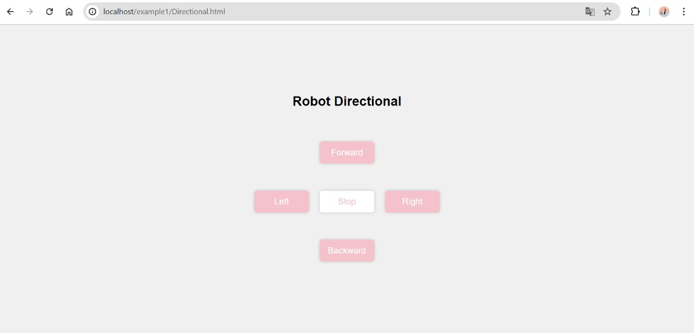

# Robot Direction Display Project

## Introduction
This project retrieves the last recorded robot direction from a MySQL database and displays it in a styled HTML page using PHP. This project showcases my journey of learning and implementing database-driven web content with real-time updates and a user-friendly interface, utilizing only PHP and HTML.

## Prerequisites
### XAMPP Installation
1. Download XAMPP from [https://www.apachefriends.org/index.html](https://www.apachefriends.org/index.html).
2. Install XAMPP on your system.

### Starting Apache and MySQL
1. Open the XAMPP Control Panel.
2. Start the Apache and MySQL services.

### Creating Database
1. Open phpMyAdmin (http://localhost/phpmyadmin).
2. Create a new database named `my_robot_db`.

### Database Table Creation
1. Within the `my_robot_db` database, execute the following SQL query to create the `directional_table`:

\```sql
CREATE TABLE directional_table (
    id INT(11) AUTO_INCREMENT PRIMARY KEY,
    direction VARCHAR(10) NOT NULL,
    created_at TIMESTAMP DEFAULT CURRENT_TIMESTAMP
);
\```

## Setting Up Project Files
### Creating Project Directory
1. Open Visual Studio Code (VS Code).
2. Navigate to the XAMPP `htdocs` folder (`C:\xampp\htdocs`).
3. Create a new folder named `output_example1` for your project.

### Project Structure
- `output_example1/`
  - `index.html`: HTML page to display the last direction.
  - `get_last_direction.php`: PHP script to retrieve the last direction from the database.
  - `code/`: Folder to organize all project code files.

## HTML Interface
### Creating HTML File (`index.html`)
1. Inside `output_example1/`, create a new file named `index.html`.
2. Add the following HTML code:

## PHP Backend
### Creating PHP File (`get_last_direction.php`)
1. Inside `output_example1/`, create a new file named `get_last_direction.php`.
2. Add the following PHP code:

## Usage

1. Start XAMPP and ensure Apache and MySQL are running.
2. Open a web browser and go to [http://localhost/output_example1/index.html](http://localhost/output_example1/index.html).
3. The page will display the last direction saved in the database in a styled box.

## Screenshots


*Screenshot of the HTML interface with directional buttons.*


*Screenshot of the `directional_table` structure in `my_robot_db`.*


*Screenshot of the HTML interface displaying the last direction.*

## Code Folder
### Code Directory (`code/`)
- Place all project code files here, including `index.html` and `get_last_direction.php`.

## Conclusion
This project demonstrates how to use PHP and HTML to create a functional and interactive display of database content. It highlights my ability to connect front-end and back-end components seamlessly.
